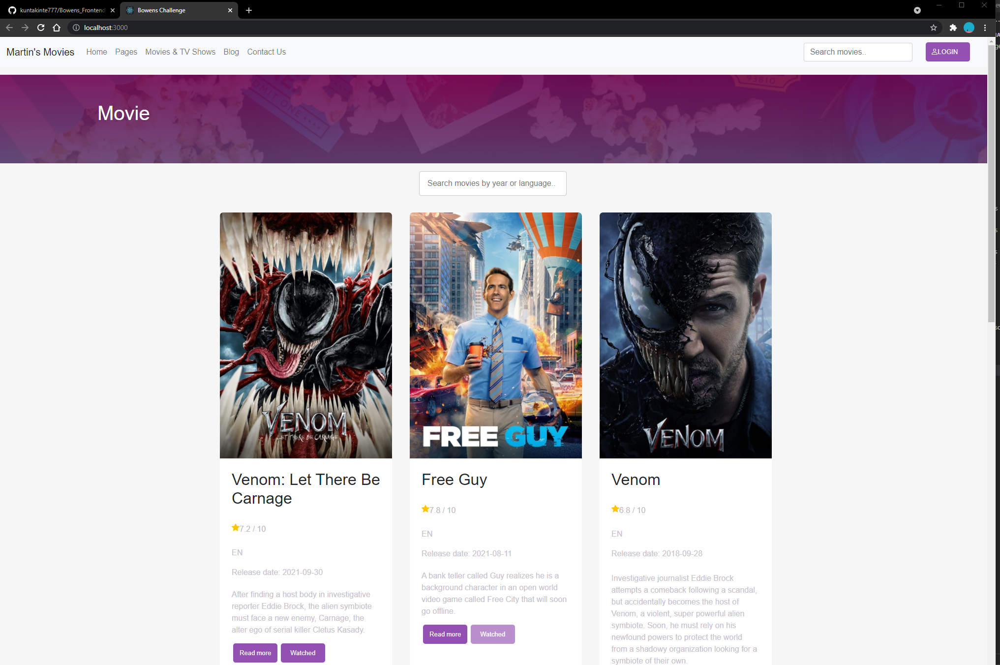

# Frontend Challenge by Bowens.

## Attempted by:

Minjin Chou

## Code documentation - Release 0.0.1 - 17/10/2021

- Data from TMDB API are displayed.
- Users can search data by: keywords, year and language(language-codes eg. EN/JA).
- Users are able to mark movies as watched. 
- Movies will no longer be unwatch when refreshing/reopening browser.
- Read more button are linked to IMDB page.
- Pagination of pages done.
- Movie listing page design matches client's desired theme from:
  'http://klbtheme.com/movify/movie-grid-3/'

## Basic webpage overview:

 
    
 

To run the application locally :

1. cd into bowens-challenge
2. run "npm start"

Note:
As requested by client, each links on main page are dead link for now.
